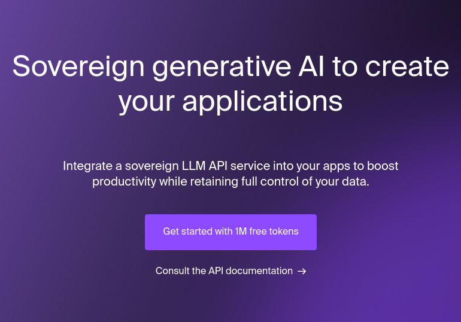
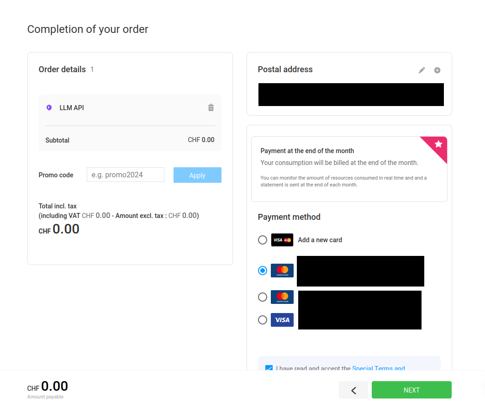
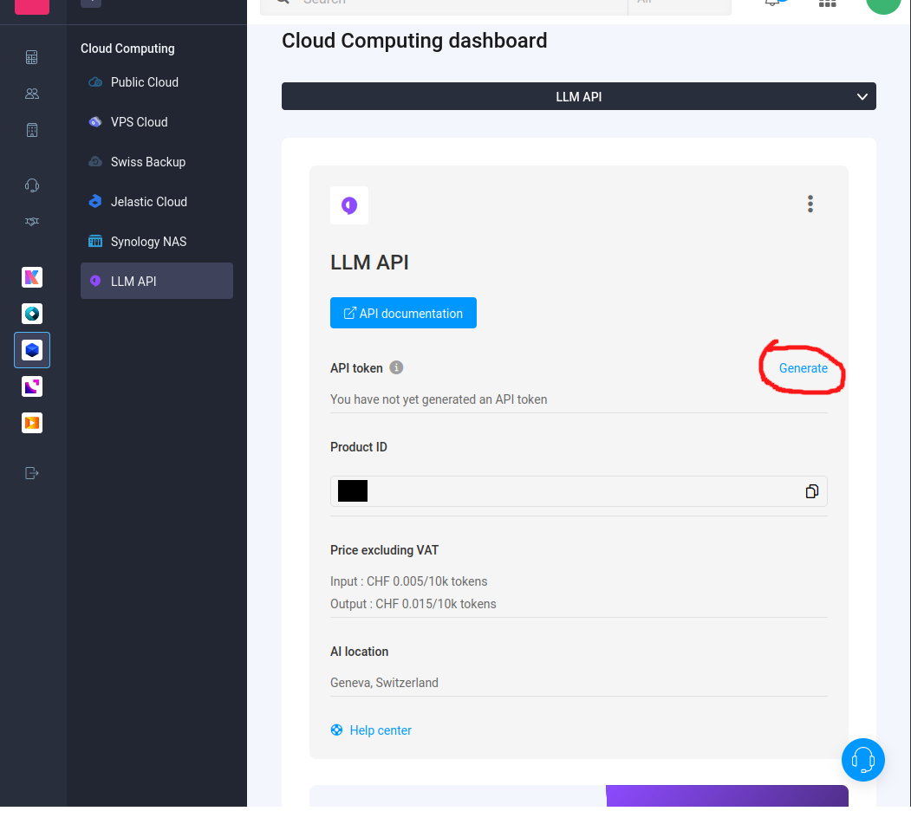
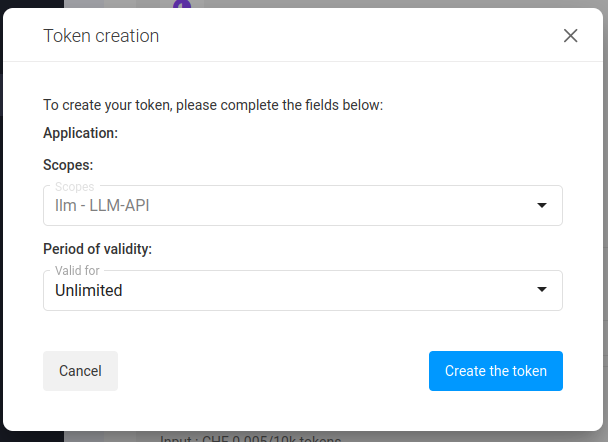
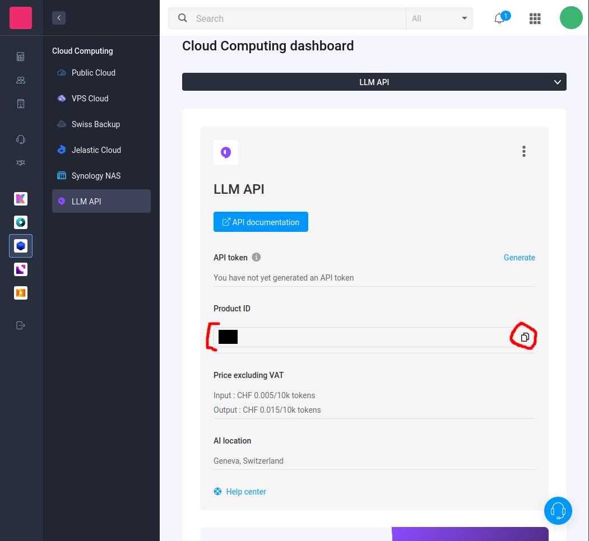

# Getting started

First of all create an Infomaniak account: https://www.infomaniak.com

It's free and done quickly. Moreover, it includes a free email address, a free drive, and a free trial on an LLM API.

Next, you'll have to register on the [free LLM API by, clicking this link](https://shop.infomaniak.com/order2/llm):

[](https://www.infomaniak.com/en/hosting/llm-api)

It will be asked to enter a payment method. But don't worry, you'll have **1 million free tokens** to start:



Then, navigate to [the manage LLM API page](https://manager.infomaniak.com/v3/493907/ng/products/cloud/llm-api),
and click the `generate` button to create a token for the API:





Copy and save your token, we'll use it in a few seconds:


Finally, copy your product id:



Alright, you're ready for your first prompt !


We'll use Deno for convenience, but you may use NodeJs too:

```ts 
// main.ts
import { InfomaniakClient } from 'https://deno.land/x/infomaniak@0.1.0/mod.ts';

async function main() {
  // first, we create an instance of `InfomaniakClient` with our token,
  // this will give us a nice client to communicate with the API.
  const client = new InfomaniakClient({
    apiKey: 'YOUR TOKEN',
  });
  
  // then, we query the `llm API`:
  // for more details check the documentation: https://developer.infomaniak.com/docs/api/post/1/llm/%7Bproduct_id%7D 
  const response = await client.llm.query({
    product_id: 'YOUR PRODUCT ID',
    messages: [
      {
        role: 'user',
        content: 'Write a short letter to your future self',
      },
    ],
  });

  console.log(response);
}

main();
```

Finally, we may run our script using the following command:

```bash
deno run --watch --allow-net --allow-read --allow-env  ./main.ts
```

And voila ! Now, your imagination is the only limit.

---

**NOTE:** for security reasons, you should store your token inside a `.env` file, and never copy it directly inside your code.
Else, you may accidentally share it publicly.
Take a look at the [llm example file](../examples/llm.ts) for more details.
